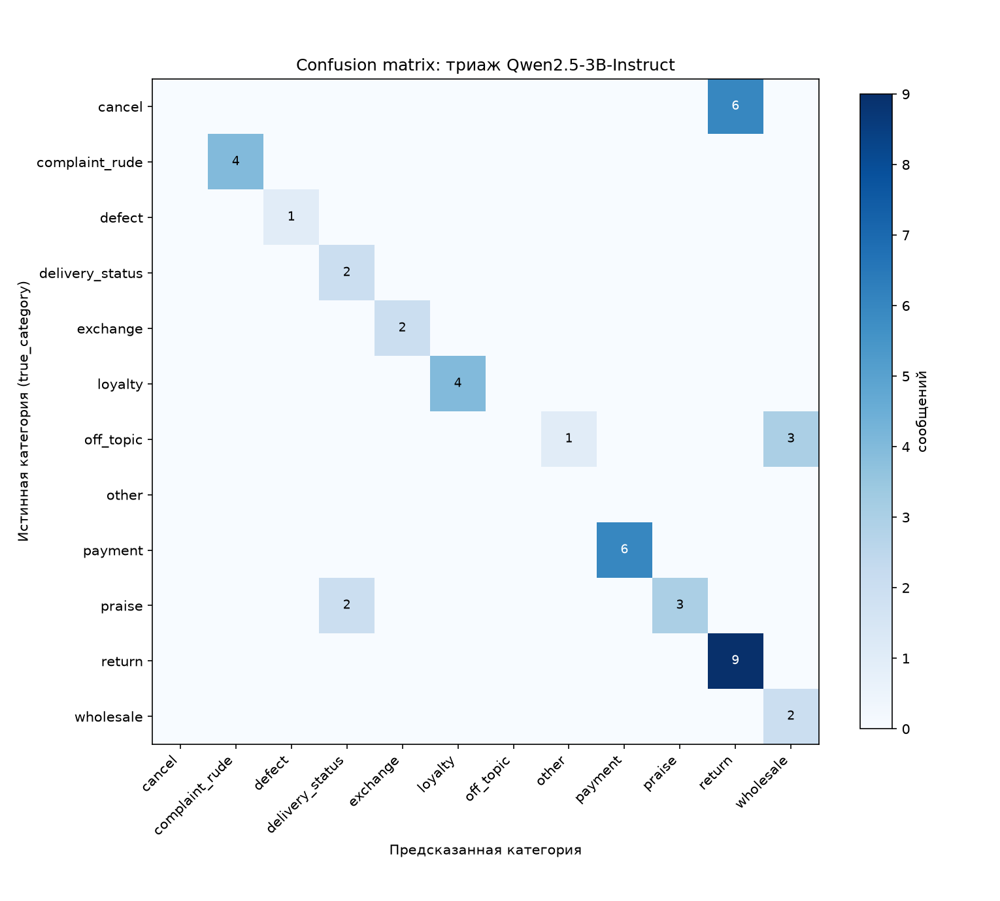

# Support Triage LLM — триаж обращений клиентов через локальную LLM


Пет-проект на стыке Data/LLM-инженерии: обращения клиентов интернет-магазина
классифицируются локальной LLM (Qwen2.5-3B-Instruct через Ollama, без единого
внешнего API-вызова и без затрат на токены) с RAG-контекстом из базы знаний
магазина, результат пишется в Postgres и связывается с той же БД, что
использует [`etl-portfolio`](https://github.com/exist-ty/etl-portfolio) и
[`product-marketing-analytics`](https://github.com/exist-ty/product-marketing-analytics).

Три вопроса, на которые отвечает этот репозиторий:

1. Можно ли классифицировать и приоритизировать обращения в поддержку локальной
   3B-моделью без GPU и без внешнего API — и где проходит граница её надёжности?
2. Различается ли профиль обращений (доля негатива/high-priority) между
   маркетинговыми каналами привлечения?
3. Как выглядит production-грейд RAG (векторный индекс в БД, а не Python-цикл)
   и как оценить качество LLM-классификации метриками, а не на глаз?

## Стек

Python, Ollama (Qwen2.5-3B-Instruct + all-minilm), PostgreSQL + pgvector
(HNSW) + полнотекстовый поиск (tsvector/GIN), pydantic, scikit-learn
(evaluation), Docker, pytest.

## Архитектура

```
client_messages (БД triage/pgvector; customer_id — из реального
                 customer_id в stg_customers, БД etl_portfolio)
        │
        ▼
  embed (all-minilm, Ollama)
        │
        ▼
  гибридный поиск: векторный (pgvector, HNSW, <=>) + полнотекстовый
  (tsvector, GIN), объединены через RRF  ──▶  src/rag.py
        │
        ▼
  промпт: обращение + top-k выдержек из базы знаний
        │
        ▼
  Qwen2.5-3B-Instruct (Ollama, format=json)
        │
        ▼
  pydantic-валидация + retry на невалидный JSON  ──▶  src/triage.py
        │
        ▼
  triage_results (category, sentiment, priority, confidence, suggested_reply)
        │
        ▼
  scripts/evaluate_llm.py: category vs. true_category → F1, confusion matrix
```

## Структура

- `sql/triage_schema.sql` — `kb_documents` (`VECTOR(384)` + HNSW-индекс,
  `search_tsv` generated column + GIN-индекс) / `client_messages`
  (+ `true_category`) / `triage_results` — БД `triage`
  (см. «Production RAG: pgvector» и «Гибридный поиск» ниже)
- `src/kb.py` — база знаний магазина (доставка, возврат, гарантия, оплата и т.д.)
- `src/ollama_client.py` — тонкий клиент поверх Ollama HTTP API (chat + embed)
- `src/rag.py` — retrieval: векторный (pgvector, `<=>`) + полнотекстовый
  (`tsvector`/GIN) + `reciprocal_rank_fusion`, объединяющий оба в `hybrid_search`
- `src/triage.py` — промпт, pydantic-схема ответа, retry-логика
- `src/db.py` — два движка: основная БД `etl_portfolio` (только чтение
  `stg_customers`/`stg_orders`) и БД `triage` (pgvector)
- `scripts/load_kb.py` — считает эмбеддинги базы знаний и грузит в `triage`
- `scripts/generate_messages.py` — синтетические обращения, привязанные к
  реальным `customer_id`/заказам из `etl-portfolio`, с `true_category`
  (тема шаблона-источника — не ручная разметка, но известная "истина")
- `scripts/run_triage.py` — основной пайплайн (резюмируемый: пропускает уже
  обработанные сообщения)
- `scripts/channel_triage_summary.py` — кросс-БД связка с `stg_customers.channel`
  (JOIN теперь в pandas — см. «Production RAG» ниже)
- `scripts/evaluate_llm.py` — F1 по классам и confusion matrix (`true_category`
  vs. предсказание модели)
- `tests/` — pytest на парсинг/валидацию структурированного вывода LLM (без
  реальных вызовов модели — на моках)
- `docker-compose.yml` + `Dockerfile` — Ollama + Postgres/pgvector + приложение
  одной командой

## Как запустить

Локально:
```
python -m venv .venv
.venv\Scripts\activate
pip install -r requirements.txt
cp .env.example .env
ollama pull qwen2.5:3b-instruct
ollama pull all-minilm
docker compose up -d vector-db          # Postgres + pgvector, порт 5433
psql -U postgres -h localhost -p 5433 -d triage -f sql/triage_schema.sql
python scripts/load_kb.py
python scripts/generate_messages.py
python scripts/run_triage.py
python scripts/channel_triage_summary.py
python scripts/evaluate_llm.py
pytest
```

Через Docker (поднимает Ollama + Postgres/pgvector-контейнеры + прогоняет
весь пайплайн одной командой):
```
docker compose up --build
```

## Production RAG: pgvector

Раньше: эмбеддинги как `double precision[]`, cosine similarity — brute-force
Python-цикл в numpy (`src/rag.py`), оправдано только при базе знаний в
10-15 документов (в локальной установке PostgreSQL 17 на Windows extension
`vector` недоступен без сборки из исходников — не числится даже в
`pg_available_extensions`).

Теперь: `kb_documents.embedding VECTOR(384)` в отдельном Postgres-контейнере
`pgvector/pgvector:pg17` (порт 5433, БД `triage`) — образ уже содержит
собранное расширение, компилировать самому не нужно. HNSW-индекс
(`vector_cosine_ops`) вместо IVFFlat: строится быстрее и точнее на
базах такого масштаба (IVFFlat выигрывает только когда HNSW не влезает по
памяти при построении на очень больших коллекциях). `src/rag.py` теперь
не выкачивает все документы в Python — `ORDER BY embedding <=> :query LIMIT k`
выполняется движком БД с использованием индекса.

**Плата за это:** `client_messages.customer_id` больше не `FOREIGN KEY` на
`stg_customers.customer_id` — Postgres не умеет внешние ключи между базами
(тем более между контейнерами). Ссылочная целостность держится на том, что
`generate_messages.py` берёт `customer_id` из реального `SELECT` по
`etl_portfolio`, а не constraint'ом. По той же причине
`scripts/channel_triage_summary.py` больше не может JOIN'ить
`triage_results` и `stg_customers` одним SQL-запросом — две разные БД,
поэтому объединение делает `pandas.merge` в Python. Осознанный компромисс,
не забытый баг.

## Гибридный поиск: векторный + полнотекстовый (RRF)

Чистый векторный поиск (только cosine similarity по эмбеддингам) — не то,
что используют production RAG-системы: он не видит точных лексических
совпадений (номер заказа, конкретный термин из политики), которые для
короткой базы знаний из 10 документов иногда важнее семантической близости.
Добавлен второй, полнотекстовый поиск — по `kb_documents.search_tsv`
(генерируемая колонка `to_tsvector('russian', title || ' ' || content)`,
GIN-индекс) — и оба объединены через **Reciprocal Rank Fusion**
(`src/rag.py::reciprocal_rank_fusion`): score(doc) = Σ 1/(60 + rank в каждом
списке). RRF взят вместо нормализации и суммирования сырых скоров
намеренно — cosine similarity (0..1) и `ts_rank` (произвольный, несравнимый
масштаб) нельзя честно сложить без нормализации, а RRF использует только
позицию в ранжировании, поэтому не требует её.

**Находка по пути: `plainto_tsquery` не подошёл.** Первая версия
`sparse_search` использовала `plainto_tsquery`, который **ANDит** все леммы
запроса — обращение вида "Хочу оформить возврат..." почти никогда не
матчилось с формальной базой знаний ("Товар... можно вернуть...") только
потому, что в документе нет леммы "хоч". Разговорный тон клиентских
сообщений и безличный тон базы знаний — разные регистры речи, строгое AND
между ними не работает. Починено переходом на леммы запроса, объединённые
через OR (`to_tsquery` из `tsvector_to_array(to_tsvector(...))`, склеенных
` | `) — так полнотекстовый поиск ранжирует по числу совпавших термов, а не
фильтрует по требованию "все термы обязательны".

**Что реально изменилось при повторном честном прогоне** (те же 45
сообщений, схема пересоздана, `client_messages`/`triage_results`
перегенерированы заново — см. «Оценка качества» ниже): accuracy 0.69 → 0.71,
найденные документы для части сообщений реально сменились (не просто другой
скор, другой набор top-k) — и это не всегда чинит классификацию: для
`off_topic`-сообщений гибридный поиск перестал подтягивать документ про
"Корпоративные и оптовые заказы" вообще, но модель всё равно в 3 из 4 случаев
классифицирует их как `wholesale` — то есть эта конкретная ошибка была
отчасти собственным семантическим смещением модели ("сотрудничество" звучит
как business/wholesale), а не только артефактом плохого поиска, как
предполагалось раньше.

## Результаты на реальных данных

45 синтетических обращений (11 шаблонов-тем, честно сгенерированы с
привязкой к реальным заказам), полностью прогнаны через Qwen2.5-3B-Instruct
на CPU (GPU — NVIDIA MX250 2GB, собранный под неё Ollama-рантайм падает с
несовместимостью CUDA-тулчейна, см. «Честные ограничения» ниже).

| предсказанная category | count |
|---|---|
| return | 15 |
| payment | 6 |
| delivery_status | 5 |
| wholesale | 5 |
| complaint_rude | 4 |
| loyalty | 4 |
| exchange | 2 |
| praise | 2 |
| defect | 1 |
| other | 1 |

Средняя уверенность модели (`confidence`) — 0.83, среднее время обработки
одного сообщения (embed + retrieval + классификация) — ~32 сек. на этом CPU.

**В часах, не только в секундах.** Если оператор поддержки тратит на прочтение,
классификацию и черновик ответа условно ~2 минуты на обращение (оценка, не
измерение — реального оператора в этом проекте нет), а автоматический первый
проход занимает ~32 сек., это ~73% экономии времени именно на этом шаге. На
объёме 1 000 обращений в месяц — это ≈27 часов операторского времени. Это
честная оценка выигрыша **первого прохода**, а не полной автоматизации: при
accuracy 69% (см. ниже) результат — черновик с категорией и приоритетом,
который оператор всё ещё проверяет, особенно на классах, где модель
систематически ошибается (`cancel`, `off_topic`) — экономия там, где модель
уверена и права, а не универсальная замена оператора.

**Пример триажа high-priority/negative обращения:**
> «Очень недоволен обслуживанием по заказу #553, оператор грубо ответил в
> чате. Разбираюсь третий день без результата!»

→ `category=complaint_rude, sentiment=negative, priority=high`, черновик
ответа модель сгенерировала со ссылкой на конкретную проблему из обращения.

**Каналы** (`scripts/channel_triage_summary.py`, кросс-БД `pandas.merge` с
`stg_customers` из etl-portfolio): на этой выборке `referral` даёт
наибольшую долю негатива/high-priority обращений (25%) против 10-20% у
остальных каналов (`context_ads` 20%, `email` 12.5%, `seo` 11.1%, `social_ads`
10%) — но при n=45 это не более чем наблюдение, не статистически значимый
вывод. Совпадение `negative_share`/`high_priority_share` по каждому каналу —
не баг агрегации: на этой выборке модель ни разу не поставила `priority=high`
без `sentiment=negative` и наоборот.

**Кросс-репо наблюдение.** В [`product-marketing-analytics`](https://github.com/exist-ty/product-marketing-analytics)
`referral` — канал с лучшим ROMI (см. его README). Здесь же у `referral`
наибольшая доля недовольных обращений. Оба вывода честно ограничены малым n
(45 обращений / 200 клиентов), но направление одно и то же в двух независимо
посчитанных выборках: дешёвое привлечение через `referral` стоит проверять не
только по стоимости (CAC/ROMI), но и по качеству клиентского опыта, прежде
чем масштабировать канал.

## Оценка качества (`scripts/evaluate_llm.py`)

`true_category` — тема шаблона, из которого сгенерировано сообщение (см.
`generate_messages.py`): не ручная разметка человеком, а точно известная
по построению данных "истина". Сравнение с реальным предсказанием модели:

```
accuracy: 0.71   macro F1: 0.62   weighted F1: 0.64   (n=45, гибридный поиск)
```

Для сравнения: до перехода на гибридный поиск (тот же промпт, тот же
датасет-шаблон, чистый векторный поиск) было `accuracy: 0.69, macro F1: 0.64,
weighted F1: 0.61`. Accuracy и weighted F1 выросли, macro F1 чуть просел —
честно: это не однозначное улучшение по всем метрикам, а перераспределение
ошибок (см. ниже, почему).

| category | precision | recall | F1 | support |
|---|---|---|---|---|
| complaint_rude | 1.00 | 1.00 | 1.00 | 4 |
| defect | 1.00 | 1.00 | 1.00 | 1 |
| exchange | 1.00 | 1.00 | 1.00 | 2 |
| loyalty | 1.00 | 1.00 | 1.00 | 4 |
| payment | 1.00 | 1.00 | 1.00 | 6 |
| return | 0.60 | 1.00 | 0.75 | 9 |
| delivery_status | 0.40 | 1.00 | 0.57 | 2 |
| wholesale | 0.40 | 1.00 | 0.57 | 2 |
| praise | 1.00 | 0.40 | 0.57 | 5 |
| **cancel** | 0.00 | 0.00 | 0.00 | 6 |
| **off_topic** | 0.00 | 0.00 | 0.00 | 4 |
| other* | 0.00 | 0.00 | 0.00 | 0 |

\* `other` — валидная категория (`src/triage.py::ALLOWED_CATEGORIES`), но
среди 45 шаблонов нет ни одного с `true_category=other`; модель один раз
сама выбрала эту категорию для `off_topic`-сообщения (см. ниже) — строка
появляется только потому, что `other` встретился среди предсказаний.



Confusion matrix называет ровно то, что раньше было честной, но качественной
формулировкой ("категории схлопываются") — теперь с числами и конкретным
направлением ошибки:

- **Все 6 `cancel` → `return`, без изменений после перехода на гибридный
  поиск.** Модель видит "хочу отменить заказ" и "хочу вернуть заказ" как
  один и тот же интент — оба про "не хочу этот заказ", различие в моменте
  (до/после доставки) 3B-модель на CPU без fine-tuning не удерживает без
  явного примера в промпте. Это ожидаемо не поменялось: причина в понимании
  текста моделью, а не в том, что поиск находит не тот документ — гибридный
  поиск чинит retrieval, а не то, как модель рассуждает над текстом.
- **3 из 4 `off_topic` → `wholesale`, 1 из 4 → `other`.** Раньше (чистый
  векторный поиск) все 4 уходили в `wholesale`, потому что retrieval
  подтягивал документ "Корпоративные и оптовые заказы". После перехода на
  гибридный поиск этот документ вообще перестал попадать в найденный
  контекст для этого сообщения (проверено по `retrieved_doc_ids`) — но 3 из
  4 предсказаний всё равно `wholesale`. Значит часть этой ошибки — не
  артефакт поиска, как считалось раньше, а собственное семантическое
  смещение модели: "сотрудничество для обзоров" само по себе звучит как
  business/wholesale независимо от контекста.
- **2 из 5 `praise` → `praise` (было 1 из 5).** Хвалебные сообщения в
  шаблоне содержат "Спасибо за быструю доставку" — полнотекстовая часть
  гибридного поиска иногда всё ещё подтягивает документ про доставку по
  этому ключевому слову, и 3 из 5 сообщений всё ещё уходят в
  `delivery_status`. Улучшение реальное, но частичное: тот же самый
  лексический сигнал, что помогает полнотекстовому поиску в других случаях,
  здесь его и подводит.

## Трекинг экспериментов (MLflow)

`scripts/run_triage.py` и `scripts/evaluate_llm.py` пишут в **один** MLflow
run (experiment `support-triage`), а не в два разных: `run_triage.py`
логирует параметры (`chat_model`, `embed_model`, `top_k`, `rrf_k` — константа
RRF из `src/rag.py::reciprocal_rank_fusion`, не тюнится этим скриптом) и
`run_id` пишет в `exports/mlflow_run_id.json`; `evaluate_llm.py` читает этот
файл и дологирует туда же метрики (`accuracy`, `f1_macro`, `f1_weighted`) и
confusion matrix — иначе параметры и метрики оказались бы в разных runs без
связи между ними, а метрики качества физически появляются только после того,
как triage готов, не в момент классификации отдельных сообщений.

MLflow — общий сервис в `docker-compose.yml` [хаба](https://github.com/exist-ty/Nikolay-Kolesnikov-Data-Engineering-Applied-ML-LLM-Portfolio-Hub)
(`docker compose up -d mlflow`, UI на `http://localhost:5501`). Версия клиента
(`mlflow==2.19.0`) зафиксирована ровно под тег образа сервера — см. README
`product-marketing-analytics` за подробностями (там же впервые поймали
несовместимость версий).

## Честные ограничения

- **Категории схлопываются predictable-образом** — см. confusion matrix
  выше: не случайный шум, а систематическая путаница у семантически близких
  категорий (cancel/return, не связано с поиском) и собственное семантическое
  смещение модели (off_topic/wholesale) — гибридный поиск подтвердил, что
  вторая проблема лишь частично связана с найденным контекстом (см.
  «Гибридный поиск» выше).
- **n=45.** Честный end-to-end прогон на слабом железе за разумное время,
  но 1-2 support на класс (`defect`, `exchange`, `praise`) — F1 на таких
  классах шумит от одного сообщения к другому, не статистическая оценка.
- **Железо.** GPU (NVIDIA MX250, 2GB VRAM) не тянет CUDA-тулчейн текущей
  сборки Ollama-рантайма (`CUDA error: the provided PTX was compiled with an
  unsupported toolchain` → крэш llama-server) — весь инференс идёт на CPU
  (`OLLAMA_LLM_LIBRARY=cpu`, `CUDA_VISIBLE_DEVICES=""`), ~32 сек/сообщение.
- **8GB RAM.** Запуск Docker Desktop параллельно с CPU-инференсом модели
  реально приводил к падению Ollama-сервера при нехватке памяти — на этой
  машине это не гипотетический, а наблюдавшийся риск.

## Связь с другими репозиториями

`client_messages.customer_id` — реальный `customer_id` из `stg_customers`
([`etl-portfolio`](https://github.com/exist-ty/etl-portfolio)), `scripts/channel_triage_summary.py`
джойнит результат триажа с `channel` оттуда же — без дублирования данных
между репозиториями. Аналитика по ROMI/LTV/retention — в
[`product-marketing-analytics`](https://github.com/exist-ty/product-marketing-analytics).
